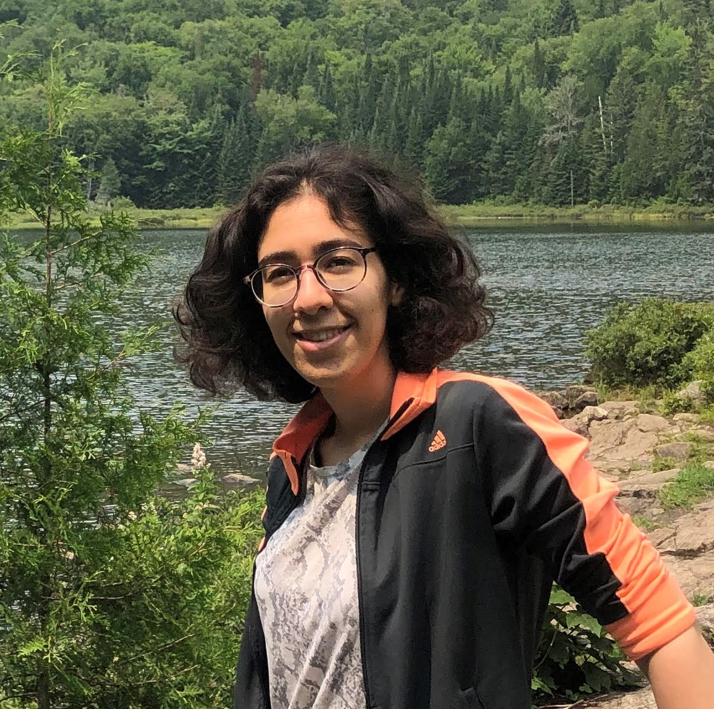

## Manoosh Samiei

I am an automotive computer vision researcher at Algolux. I develop computer vision models that can percieve the environment for application in autonomous vehicles.

Broadly, my research interests lie at the intersection of human vision, robotics, computer vision and machine learning. 
