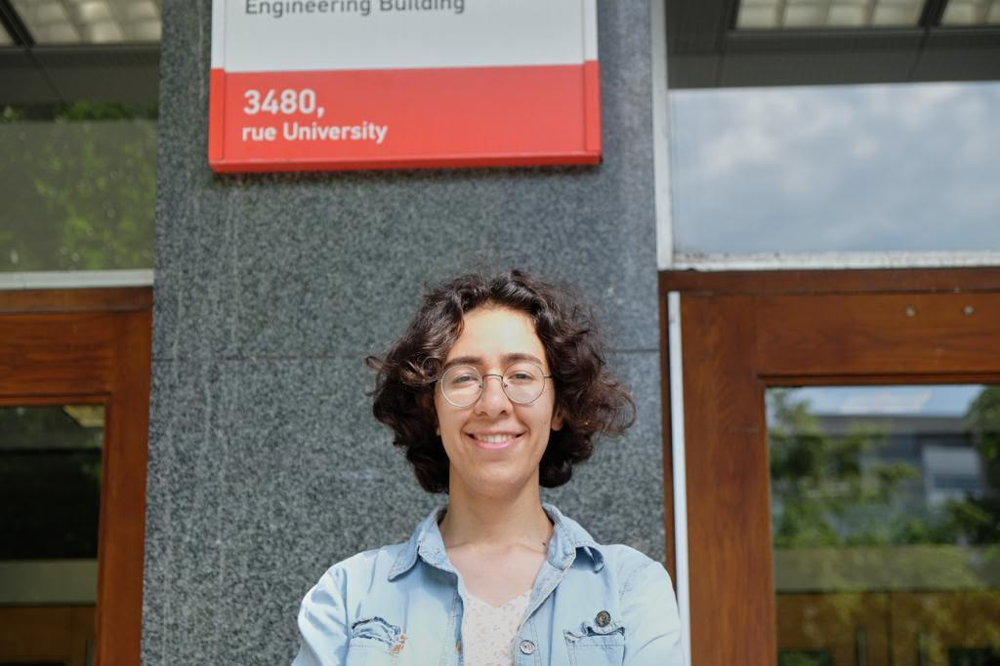

## Manoosh Samiei

I am an automotive computer vision researcher at Algolux. I develop computer vision models that can percieve the environment for application in autonomous vehicles.

Previously, I was an electrical engineering MSc student at McGill University supervised by Dr. James Clark. 

Broadly, my research interests lie at the intersection of human vision, robotics, computer vision and machine learning. At McGill and Algolux, I have worked on image segmentation, object detection and saliency prediction. I did my undergraduate at Shahid Beheshti University in electrical engineering with a focus on telecommunications and signal processing. During my undergraduate, I worked on multiple robots and learned about electronic circuits troubleshooting and assembly. Besides AI and programming, I also enjoy hardware assembly and electronic circuitry.

[Email](manoosh.samiei@mail.mcgill.ca) /
 [Github](https://github.com/ManooshSamiei) /
 [Linkedin](https://www.linkedin.com/in/manoosh-samiei-2386a1190) /
 [Twitter](https://twitter.com/SamieiManoosh)
